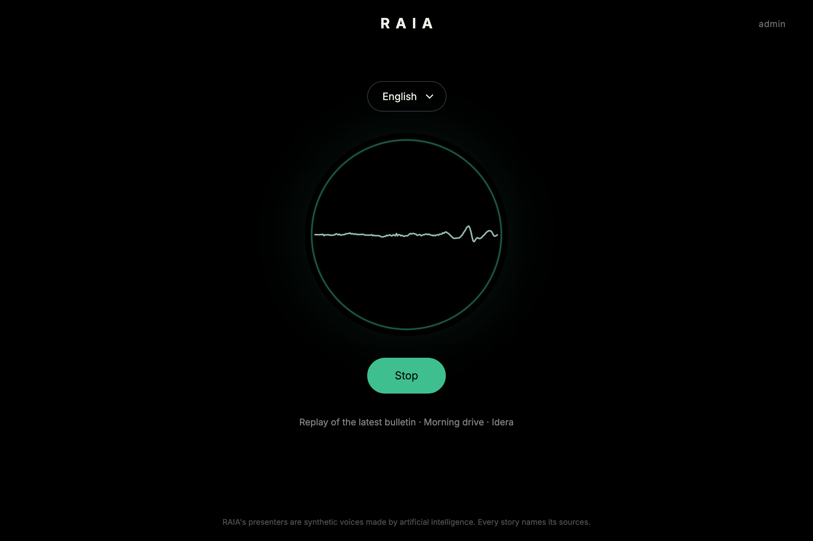
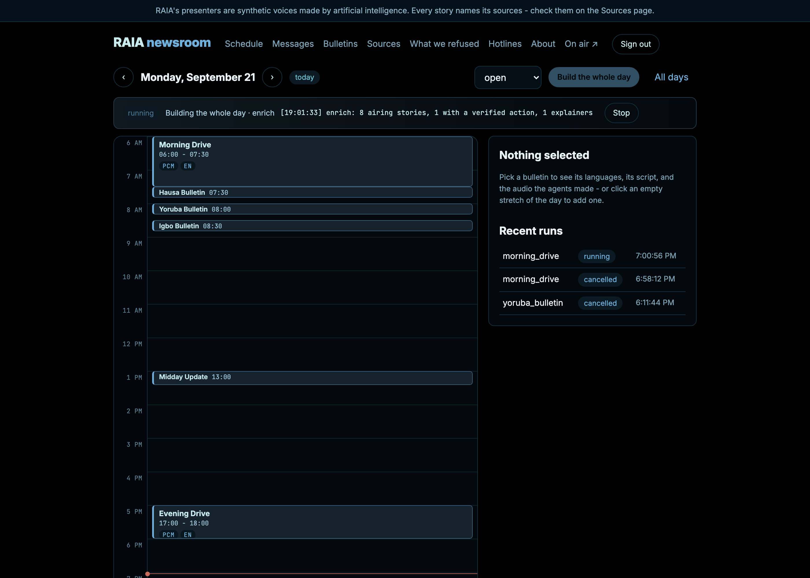
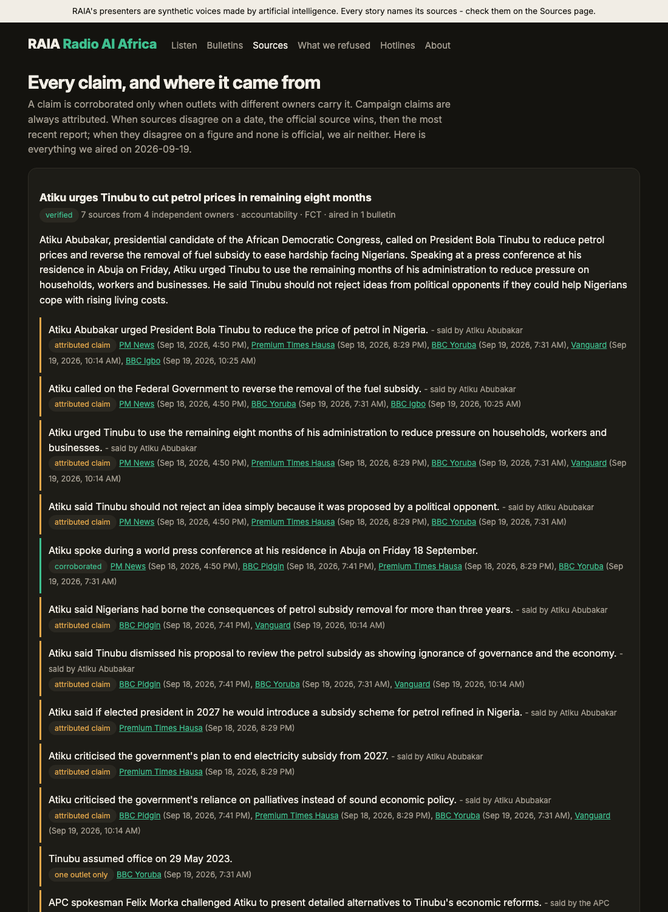

# RAIA — Radio AI Africa

**A civic radio station produced by AI agents, where every sentence that goes on air traces back to a named source you can check.**

Agents read the day's news from a verified list of Nigerian outlets, corroborate each claim across
independent owners, refuse what they cannot stand behind, write it as spoken copy, translate it into
Hausa, Yoruba, Igbo and Nigerian Pidgin, and render it to audio ahead of time. Listeners press one
button and drop into whatever is on air, the way you tune a dial. Everything the station aired — and
everything it refused to air — is published beside it.

*OSF × Andela hackathon submission. Primary track: **Transparency & Accountability**, with
**Stability & Social Cohesion** (election airtime balance, multilingual reach) and **Safety,
Reporting & Protection** (verified hotlines, a private listener desk).*



## Why radio

Most civic-information tools assume a reader with a smartphone, data, and English. Radio assumes
none of that. It reaches people while they work, in the language they think in, on the cheapest
device in the house. The hard part is not distribution — it is trust: a station that invents a date,
a figure, or a hotline number does more damage than one that stays silent.

So the design question was not "can a model write a bulletin?" It was: **what has to be true in the
code before a machine is allowed to say something out loud?**

## What it does

```
sources → extract → cluster → verify → edit → script → continuity → translate
        → diacritics → GATE → render (TTS) → measure → assemble → schedule → publish
```

- **Gathers** from 28 verified outlets (2 official, 20 national, 4 wire, 2 fact-check) in six
  languages, honouring robots.txt with per-host rate limits.
- **Corroborates**: a claim counts as confirmed only when outlets with *different owners* carry it.
  Two papers under one owner never corroborate each other.
- **Resolves contradictions with rules, not a model**: settled fact beats official source beats the
  later report — for dates. For figures with no official source, neither number airs.
- **Refuses**: a safety gate vetoes copy before synthesis; sensitive stories wait for a human
  approval with no override flag. Every refusal is published with its reason.
- **Speaks**: YarnGPT2 renders English, Hausa, Yoruba and Igbo. The presenters are synthetic and the
  station says so every hour, in every language, and on every page.
- **Runs on a clock**: bulletins air at fixed times from measured durations; the player syncs to the
  station clock so everyone in a language hears the same sentence at the same moment.

The newsroom side is a calendar: drag a bulletin to move it, click an empty stretch to add one, press
Generate, and watch the agents produce it. Overnight it builds the whole next day by itself.



## How trust is enforced in code

Not promises — these are mechanisms, each with a test or a published artefact.

| Claim | How it is enforced | Where |
|---|---|---|
| Sources are real and live | Every feed is fetched and dated before it may air; dead ones are dropped with a recorded reason (7 dropped so far) | `src/ingest/registry.py --verify` |
| Corroboration means independence | Confirmation requires two distinct *owners*, not two URLs | `src/desk/verifier.py` |
| A model never settles a dispute | Deterministic precedence rules; figures without an official source are marked unresolved and never aired | `src/desk/verifier.py`, `tests/test_verifier.py` |
| Stale facts lose to new ones | Test Case #1: when INEC moved the 2027 election dates, the station must air January, not February — proven against **real archived pages** | `tests/test_verifier.py` |
| Nothing sensitive slips through | Deterministic rules + a model review; sensitive stories need `gate.safety approve` | `src/gate/safety.py`, `tests/test_gate.py` |
| Refusals are public | The rejection log is a page on the site, not a private metric | `/admin/rejections` |
| Hotlines are never invented | Each number is confirmed on the agency's own page before it may be read; 11 of 14 passed, 3 are not aired | `src/hotlines.py --verify` |
| Timings are measured, not guessed | Every duration comes from `ffprobe`; the schedule is pure arithmetic no model touches | `src/audio/measure.py`, `src/schedule/builder.py` |
| Election coverage is balanced | Airtime per party is counted per sentence from measured speech time; an imbalance is shown, not hidden | `/admin/sources` |
| Listeners stay private | Phone numbers are stored only as salted hashes; threads expire on a TTL index; questions air with consent, first name and city only | `src/listener/desk.py` |
| Translations keep their numbers | A second model reading checks every number in Yoruba, Igbo and Hausa; a translation that loses one stays in English | `src/studio/translator.py` |



## Run it

**You need:** [uv](https://docs.astral.sh/uv/), Node 20+, FFmpeg (`brew install ffmpeg`), MongoDB on
`localhost:27017`, and two API keys in `backend/.env`:

```sh
AI_GATEWAY_API_KEY=...   # language models (Claude via the Vercel AI Gateway; see config/llm.yaml)
OPENAI_API_KEY=...       # embeddings, for grouping reports of the same event
```

```sh
# 1. Produce today's radio (first run downloads YarnGPT, ~2.5 GB)
cd backend && uv sync
uv run python -m src.pipeline.morning --lang pcm,en,ha,yo,ig

# 2. Serve it
uv run uvicorn main:app --port 8000

# 3. The site
cd ../frontend && npm install && npm run build && npm run start
```

Then open **http://localhost:3000** and press *Tune in*. The newsroom is at **/admin**
(`test` / `password1` in the demo — change `ADMIN_USERNAME` / `ADMIN_PASSWORD` in `backend/.env`).

Rendering is the slow part: YarnGPT runs several times real time on a laptop, so a full day takes a
few hours. Everything else — gathering, checking, writing, translating, gating — takes minutes, and
model answers and rendered audio are cached, so re-running a stage only pays for what changed.

| | |
|---|---|
| `backend/README.md` | the pipeline, the API, the newsroom, and the checks that keep it honest |
| `frontend/README.md` | the dial, the calendar, and how the player stays in sync |
| `RAIA_BUILD_PLAN.md` | the build plan this was built against, including its own success checks |

## What works, and what does not

Built in a hackathon; here is the honest state.

**Works:** live ingest from 28 sources; verification with contradiction resolution proven on archived
pages; the safety gate; English, Hausa, Yoruba and Igbo audio on a synced clock; the transparency
pages; the WhatsApp listener desk (tested with a simulated webhook); the newsroom calendar with
drag-to-move, per-bulletin generation, script editing, and an overnight build.

**Does not, yet:**

- **Nigerian Pidgin and Swahili have no voice model.** Their bulletins are written, translated and
  gated, and publish as text until a model is routed in — the placeholder is one config line.
- **No native speaker has confirmed the Hausa, Yoruba and Igbo audio.** That check is in the build
  plan and remains open. Whisper hears about 80% of the English words; names suffer most.
- **WhatsApp is not connected to a live number.** Without credentials the desk writes its replies to
  `runs/outbox.jsonl`.
- **The demo login is a demo login.** Signed tokens, credentials in `.env`, no user accounts.

## Built with

Python 3.12 · FastAPI · Pydantic v2 · Beanie/MongoDB · Next.js 16 · TypeScript ·
[YarnGPT2](https://huggingface.co/saheedniyi/YarnGPT2) for Nigerian-accented speech · FFmpeg ·
Claude (Opus and Sonnet) for the desk, studio and safety gate, through one gateway module so the
provider and model per job stay configuration.

`uv run pytest` — 43 tests covering the verifier (including Test Case #1 on archived pages), the
safety gate, schedule arithmetic, airtime balance, the listener desk, and spoken-copy hygiene.

## Credit where it is due

The outlets whose reporting this station reads are named on every page it airs, and linked back to
their own pages. RAIA summarises and attributes; it does not replace them.
